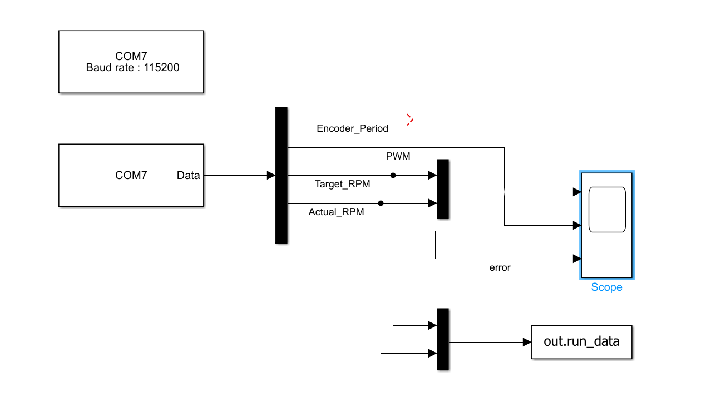

# Closed-Loop DC Motor Control & HIL Telemetry System

## 1. Project Overview
A real-time control system designed to regulate the speed of a 12V DC motor. This project focuses on applied control theory, utilizing a custom discrete PI controller running on an Arduino, backed by signal processing routines to clean physical sensor noise, and streaming high-speed binary telemetry to MATLAB/Simulink for performance validation and step-response analysis.

*Click the image above to watch the full system demonstration on YouTube.*

## 2. Control System Architecture & Signal Processing
* **The Plant:** 12V DC Motor driven by an L298N H-Bridge (PWM actuation).
* **Feedback Loop & Noise Rejection:** Speed is measured using an optical photo-encoder disk via hardware interrupts. Photo-encoders inherently suffer from optical jitter and slot-edge transition bounce, which create microsecond timing glitches that translate into mathematically impossible RPM spikes out of the motor's capabilities (e.g., instant jumps to >300 RPM).
  * **Rolling Period Buffer:** To stabilize raw interrupt measurements, pulse interval times are pushed into a 4-sample circular buffer (`periodSum`), averaging out single-pulse anomalies.
  * **Outlier / Spike Rejection:** Incoming pulse intervals are validated against a delta-time sanity threshold (rejecting pulse-to-pulse intervals corresponding to impossible angular acceleration).
  * **EMA Low-Pass Filter:** The buffered RPM is passed through an Exponential Moving Average filter ($y[k] = 0.6 \cdot y[k-1] + 0.4 \cdot x[k]$) to eliminate remaining high-frequency noise before feeding the controller.
* **The Controller:** A deterministic 20Hz discrete PI control algorithm ($dt = 0.05\text{s}$) featuring:
  * **Integral Anti-Windup:** Clamping the error integral to prevent actuator saturation and massive overshoot.
  * **Deadband Filter:** Eliminating steady-state hunting near the setpoint ($\pm 3\text{ RPM}$).
  * **Kinetic Kickstart:** A temporary feed-forward PWM burst to overcome static breakaway friction before the PI loop takes over.

## 3. Embedded Firmware & Safety Operations
While the core emphasis remains on control theory, efficient embedded architecture supports the control loop's timing integrity:
* **Periodic Cooperative Scheduler:** A non-blocking `50ms` timer loop ensures that control math and signal filtering execute strictly at $20\text{Hz}$ without using delaying sleep functions.
* **Atomic Memory Protection:** Disables interrupts (`noInterrupts()`) briefly during multi-byte period buffer reads to prevent variable corruption during high-speed pulse capture.
* **High-Speed Binary Telemetry:** Control data is packed into a lightweight 16-byte binary payload using raw memory pointer casting `(uint8_t*)`. This eliminates ASCII conversion overhead (`Serial.print`), preventing CPU bottlenecks and serial buffer backpressure.
* **Operational Safety Interlocks:** Features a software E-Stop interrupt, a mandatory zero-throttle reset interlock on startup, and dynamic back-EMF protection during direction changes.

## 4. Telemetry & Validation
To validate the control logic, the microcontroller streams live telemetry to Simulink.

* **Synchronized Fixed-Step Solver:** Simulink is configured with a `0.05s` discrete solver, locking it to the MCU's control loop frequency to prevent frame drops or buffer overruns.
* **Step Response & Tuning:** The system was tuned ($K_p = 0.2$, $K_i = 0.8$) under dynamic setpoint changes, demonstrating fast rise time with near-zero overshoot and robust disturbance rejection.

## 5. Future Roadmap
Planned upgrades to align the system closer to Formula SAE powertrain standards:
* **Physical Power Isolation (Hardware E-Stop):** Upgrading the software-flag E-Stop to a physical high-side relay/MOSFET disconnect to isolate motor power directly at the hardware layer.
* **Full Plant Simulation in Simulink (Full HIL):** Evolving the setup so that Simulink mathematically models the motor's electrical and mechanical transfer function (the plant), while the Arduino acts purely as the hardware ECU, processing virtual inputs and sending real-time actuation signals over the link.

## 6. How to Run
1. Flash the `motor_control.ino` file to the Arduino.
2. Open `telemetry_model.slx` in Simulink and configure the `Serial Receive` COM port.
3. Ensure the physical potentiometer is zeroed (Throttle Interlock Safety).
4. Run the Simulink simulation and adjust the throttle to observe real-time tracking.
