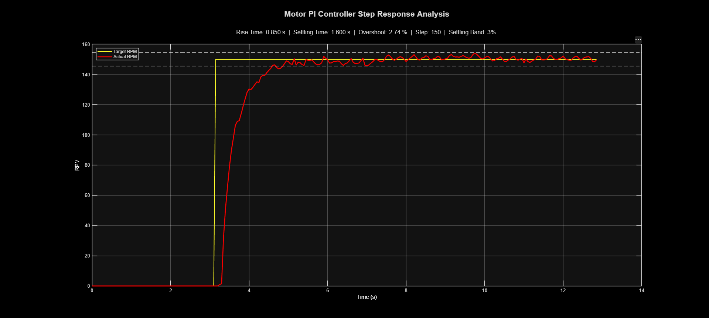

# Closed-Loop DC Motor Controller

An Arduino-based closed-loop DC motor speed controller using encoder feedback, PI control, safety interlocks, and real-time MATLAB/Simulink telemetry.

## Overview

The system regulates DC motor speed using a 20-slot optical encoder and a discrete PI controller.

```text
Throttle → Target RPM → PI Controller → PWM → L298N → Motor
                                      ↑              ↓
                                      └── Encoder ───┘
```

MATLAB/Simulink is used for real-time telemetry and performance analysis.

### Project Demonstration

[](https://www.youtube.com/watch?v=Vs8Mu4jvZHY)

*Click the image to watch the full project demonstration.*

## Hardware

- Arduino Uno
- Yellow TT geared DC motor
- L298N H-bridge driver
- 9 V DC motor supply
- 20-slot optical encoder
- 16×2 I²C LCD
- Potentiometer
- Direction pushbutton
- Emergency-stop pushbutton + LED

## Control System

### PI Controller

The controller runs at a nominal **20 Hz** update rate and uses the measured timestep `dt`.

Features include:

- Proportional + integral speed control
- Integral limiting
- Small error deadband
- Dynamic kick-start for starting from rest
- Minimum active PWM

### Encoder Processing

The encoder signal is processed using:

- Interrupt-based pulse timing
- 20 pulses/revolution
- Minimum pulse-period plausibility check
- Four-sample rolling period average
- Exponential moving-average RPM filter

An **11 ms minimum pulse period** is currently used. This rejects pulse intervals corresponding to speeds above approximately 273 RPM, above the motor's experimentally observed operating range.

## Encoder Noise Investigation

During testing, unrealistic RPM spikes were traced to occasional false encoder edges.

The issue was isolated by:

1. Running the motor at fixed PWM with PI control disabled.
2. Examining encoder pulse periods directly.
3. Counting rejected pulse intervals.
4. Testing different pulse-period thresholds.
5. Reducing wire lengths and improving wiring layout.

The results showed that motor operating conditions and wiring affected the encoder signal, highlighting the importance of signal integrity and electrical noise management in closed-loop motor control.

## Safety Features

- **Software E-stop:** Interrupt-triggered latched shutdown that commands PWM to zero.
- **Throttle interlock:** Motor cannot start until the throttle is first returned to zero.
- **Direction interlock:** Direction cannot change until motor speed is sufficiently low.
- **Kick-start control:** Separates starting behavior from normal PI control.

> The current E-stop is software-based and does not provide hardware power isolation. A hardware shutdown path is planned for future development.

## MATLAB / Simulink

Real-time telemetry is transmitted from the Arduino to MATLAB/Simulink using a binary frame:

- 2-byte synchronization header
- 5 × 32-bit floating-point values
- **22 bytes total per frame**

Telemetry includes:

- Encoder period
- Motor PWM
- Target RPM
- Filtered RPM
- Speed error

The Simulink model uses a **0.05 s fixed-step sample time** matching the nominal controller update rate.


## Step Response Analysis

To objectively evaluate the controller, the physical potentiometer was temporarily bypassed and the target speed was commanded with an automated **step from 0 to 150 RPM**.

The response was evaluated using a **3% settling band** around the final target value. The resulting telemetry was exported from Simulink to MATLAB for quantitative analysis.



The measured response was:

- **Rise Time:** 0.850 s
- **Settling Time:** 1.600 s
- **Percent Overshoot:** 2.74%
- **Settling Band:** ±3% of the 150 RPM target

The response shows stable closed-loop tracking with a small amount of overshoot and bounded steady-state variation. The remaining RPM variation is mainly attributed to encoder measurement resolution and the characteristics of the physical motor and gearbox.

## Project Structure

```text
Closed-Loop-Motor-Controller/
├── code/
│   ├── Motor_Control_Final.ino
│   ├── Motor_Control_Simulink.slx
│   └── save_data.m
├── assets/
│   ├── Step_Response.png
│   ├── project_1.jpg
│   ├── project_2.jpg
│   └── simulink_diagram_1.png
└── README.md
```

## Future Improvements

- Hardware-level E-stop and power isolation
- Improved encoder signal conditioning
- Motor-noise suppression and better decoupling
- Higher-resolution encoder
- Quantitative disturbance recovery testing and load-step analysis
- True hardware-in-the-loop testing with a Simulink motor plant

## Core Competencies Demonstrated

- **Closed-Loop Control:** Implemented and tuned a discrete PI controller using measured motor-speed feedback and evaluated its step response using experimental data.
- **Control Implementation:** Implemented the closed-loop control algorithm in C++ with PWM actuation, interrupt-based feedback measurement, timed control updates, and non-blocking execution.
- **Sensor Measurement:** Converted encoder pulse timing into RPM and added filtering and plausibility checks to handle noisy measurements.
- **Control-System Validation:** Used MATLAB/Simulink to collect telemetry and calculate rise time, settling time, and overshoot from physical test data.
- **Hardware Debugging:** Investigated encoder measurement errors by isolating the controller, analyzing pulse timing, and testing changes to filtering and wiring.
- **Safety and State Logic:** Implemented startup throttle checking, latched software E-stop behavior, and controlled direction changes.

## How to Run

### 1. Hardware

Connect the Arduino, L298N, motor, encoder, potentiometer, LCD, and buttons according to the project wiring. Use a common ground and keep the throttle at zero before startup.

### 2. Arduino

Open `code/Motor_Control_Final.ino`, install `LiquidCrystal_I2C`, select **Arduino Uno** and the correct COM port, then upload the firmware.

### 3. MATLAB / Simulink

Open `code/Motor_Control_Simulink.slx` and configure the Arduino's COM port with:

```text
115200 baud
0.05 s sample time
```

Run the model to monitor the controller telemetry.

> **Safety:** This is a low-voltage prototype and is not a safety-rated automotive system. The current E-stop is software-based and should not be relied upon as a hardware power-disconnection mechanism.
